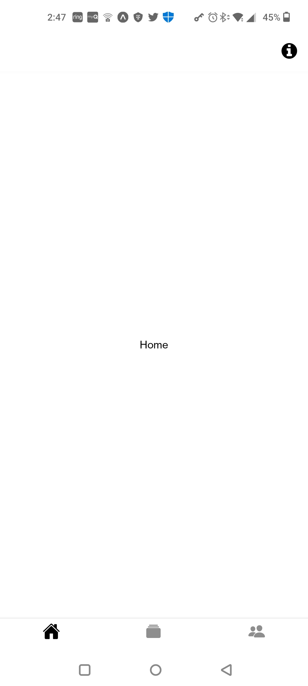
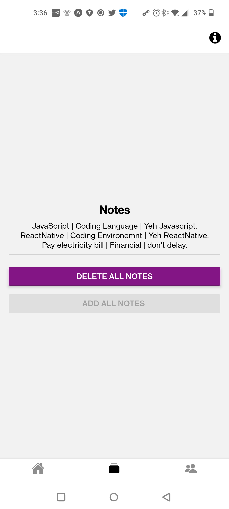
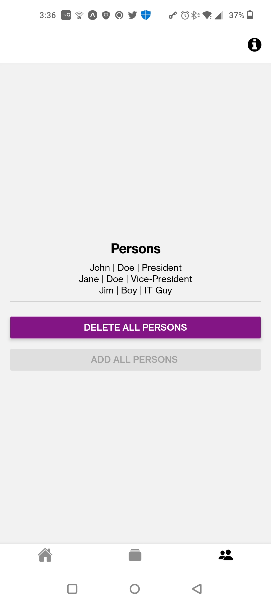
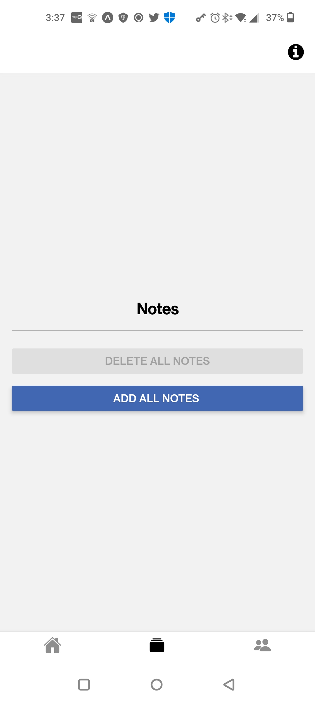
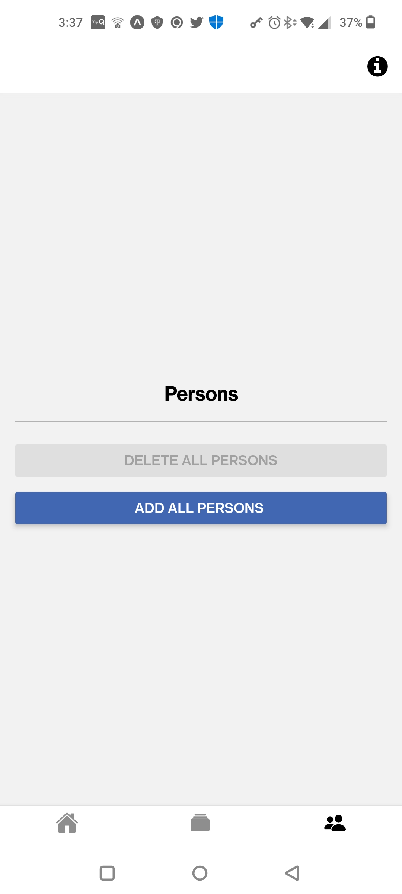

# React-Native SQLLite Example
React-Native SQL Lite Example

# Screen shots
Home | Notes | Person
:-----------:|:-----------:|:-----------:
 |  | 
Notes Add | Person Add
:-----------:|:-----------:
 | 


## Prerequisites
Required
- [yarn](https://classic.yarnpkg.com/)
- [Node.js > 12](https://nodejs.org) 
- [React Native Expo Go](https://reactnative.dev/docs/environment-setup)
  
Optional
- [nvm](https://github.com/nvm-sh/nvm)
- [Watchman](https://facebook.github.io/watchman)
- [Android Studio and Android SDK](https://developer.android.com/studio)
  
# Run this repo
- Open Administrator nodejs command window
- run following
```Shell
# Goto parent folder (ie where you store your code)
cd <parent folder>

# Download this repo [SqlLiteExample](https://github.com/huttonjd/SqlLiteExample)
git clone https://github.com/huttonjd/SqlLiteExample

# cd into repo
cd SqlLiteExample
 
# To install needed packages run
yarn install

# On your cell install __Expo Go__ from Google play or Apple Store
# NOTE: Your cellphone has to be on same network as you machine
# To run repo use one of the following
npm start
# or
expo start -c

# run code on cell by scanning barcode 
# Andriod: __Expo Go__ option
# Apple: Use camera app and select link when it comes up
```

# Tested on
## Windows 
OS - Windows 11\
NodeJs - 18.0.0\
nvm - 1.1.10
chocolatey - 1.2.1\
yarn - 1.22.19 \
expo-cli - 6.3.2 \
npm - 9.2.0 \
Andriod Studio - Dolphin 2021.3.1 patch 1

## Mac iOS
OS - Monterey\
NodeJs - 19.3.0\
yarn - 1.22.19\
npm - 9.2.0

# To run
yarn start \
or\
npm start\
or\
expo start -c